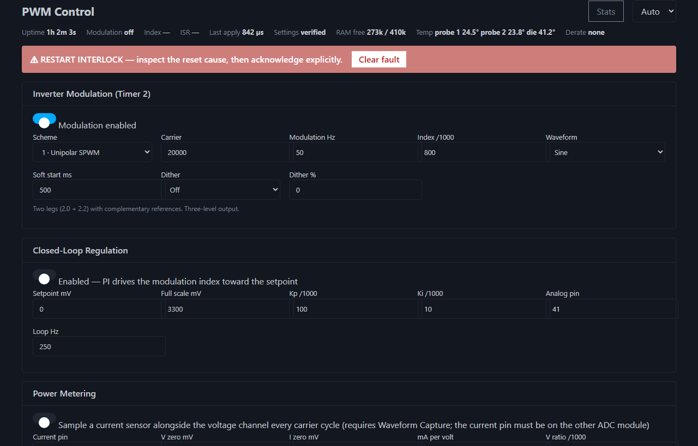
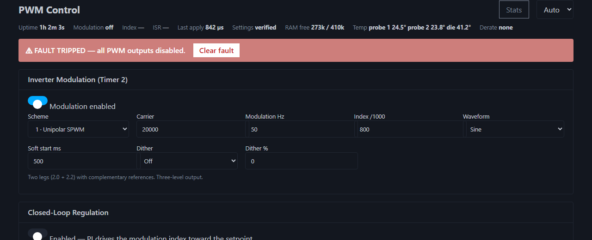
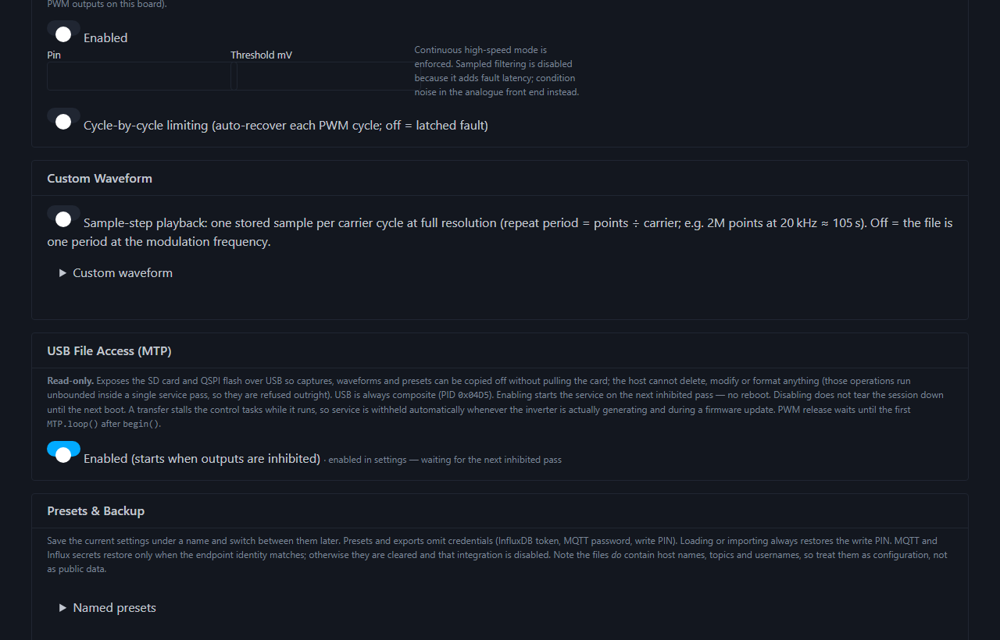
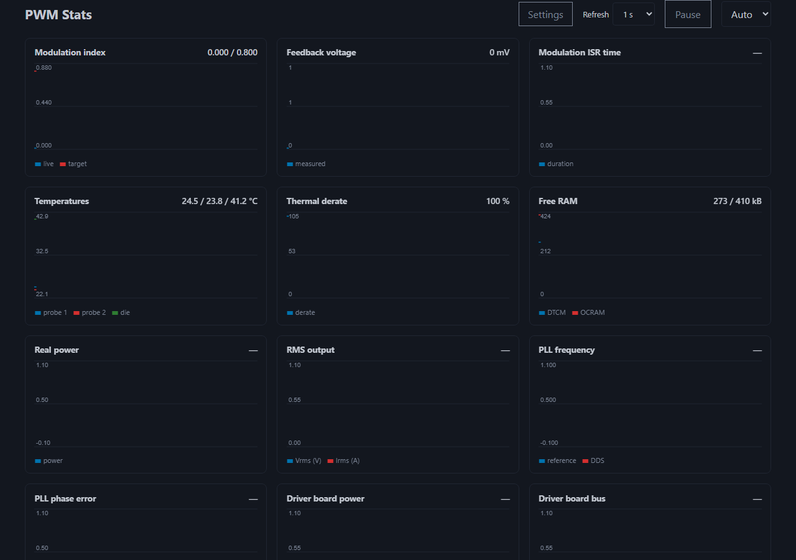

# TEG Power Generator — PWM Inverter Controller

Firmware for a **Teensy 4.1** (NXP i.MX RT1062, Cortex-M7 @ 600 MHz) that acts as a
network-controlled PWM signal generator and inverter modulator for a thermoelectric
generator (TEG) power system. It drives complementary IGBT/MOSFET gate pairs across
all four FlexPWM timer modules, with a modern web UI, a JSON API, closed-loop
amplitude regulation, a bench PLL that can lock to an external AC reference
(not a grid-tie product), maximum-power-point tracking, and both software and
hardware fault protection.

> **New features are bench-unverified.** The twelve capabilities added in
> PRs #18–#29 (everything from *Power metering* onward below) have been
> verified only by host-side unit tests and datasheet/reference-manual
> analysis — never on hardware. Read **[docs/BENCH_CHECKS.md](docs/BENCH_CHECKS.md)**
> before using them on a real power stage.
>
> **Release remains NO-SHIP** for an energised or unattended power stage until
> the disconnected-hardware checklist in
> **[docs/BENCH_CHECKS.md](docs/BENCH_CHECKS.md)** passes. Dated reviews
> ([2026-08-01](docs/REVIEW_2026-08-01.md),
> [2026-08-28](docs/REVIEW_2026-08-28.md)) record findings; slices 1–6 of the
> 28 August pass are landed in software. Host tests and later PRs are not
> ISR/OUTEN proof.
>
> **This is a bench instrument, not a product.** Every API method now requires the
> PIN, a same-subnet peer and valid Host/Origin authority; failed attempts are
> rate-limited. However, HTTP, MQTT and InfluxDB still have no TLS and the shared
> PIN travels in cleartext. Production builds disable the unsigned, single-slot
> OTA path. Keep the device on a trusted, isolated network.
> **[docs/SECURITY.md](docs/SECURITY.md)** states the exact posture;
> **[docs/PRODUCT_READINESS.md](docs/PRODUCT_READINESS.md)** covers what would
> have to change to build products on it (including an AGPL licence blocker in
> the Ethernet stack).

## Highlights

- **9 modulation schemes** — from plain fixed-duty PWM through SPWM, THIPWM, SVPWM,
  discontinuous PWM (DPWM), level-shifted multilevel carriers, and four-leg 3D-SVPWM
- **High-resolution DDS frequency control** — a 32-bit phase accumulator gives
  ~4.7 µHz tuning-word resolution at a 20 kHz carrier. A canonical FlexPWM2
  carrier now drives all four cells and the DSP, and validation rejects Nyquist,
  timer-range and asymmetric-edge violations before touching hardware
- **Measured settings apply** — parsing/programming time is reported per change;
  all output drivers are disconnected during topology/timing mutation, buffered
  values receive one module-wide LDOK, protections are armed and sampled, and only
  then are the drivers reconnected
- **Closed-loop regulation** — PI controller steers the modulation index toward a
  voltage setpoint read from an analog feedback pin
- **Grid/reference PLL** — SOGI-QSG + SRF-PLL locks the output fundamental in
  frequency *and* phase to an external AC reference, steering the DDS with no
  waveform discontinuity
- **MPPT** — adaptive perturb & observe on the modulation index, fed by real
  power measurement
- **True power metering** — simultaneous V and I sampling with real power, RMS,
  power factor and accumulated energy
- **Protection in depth** — latched software fault trip, plus an on-chip
  analog comparator path (comparator → XBAR → FlexPWM fault) intended to give
  hardware overcurrent shutdown and cycle-by-cycle current limiting with no software
  in the loop. Both latencies are derived from the reference manual, and whether the
  comparator reaches FAULT0 on this silicon is **unconfirmed** — neither has been
  measured
- **Instrumentation** — spectrum/THD analysis, a triggered single-shot scope with
  raw capture download, and a timestamped event log with an NTP-updated RTC. NTP
  replies are transaction/source/protocol checked, though NTP is not authenticated
- **Integrations** — InfluxDB metrics, MQTT with Home Assistant auto-discovery,
  and read-only USB MTP file access
- **Lab maintenance** — named configuration presets with export/import, plus a
  verify-before-commit OTA implementation that is compiled out unless the explicit
  unsafe-lab build flag is enabled
- **Modern web UI** — single-page app with automatic dark mode, live telemetry,
  and scheme-aware forms, served gzip-compressed from flash. `/pico.min.css` is a
  ~2 KB token sheet at that URL, not Pico.css v2
- **Tested core logic** — host-native Unity covers selected headers only
  (`test_build_src = no`). Firmware `.cpp` is target-only. The six-suite
  host-safe gate is `test_config_serde`, `test_features`, `test_ota`,
  `test_spectrum`, `test_thermal_math` and `test_waveform`. Name
  `test_spectrum_wire_quantize_saturates` separately from that list (Unity case
  in `test_spectrum`). `test_mqtt_discovery` is also native; report it
  separately.
  That is not ISR, OUTEN, register, boot-order, or network proof; the native
  environment cannot validate those paths

## Hardware

| Peripheral | Details |
|---|---|
| Board | Teensy 4.1 (600 MHz Cortex-M7, 512 KB TCM, 512 KB OCRAM) with a **separately fitted, mandatory 8 MB PSRAM chip** |
| PWM | All four FlexPWM modules, 9 submodules (see pin map below) |
| Network | On-board Ethernet (QNEthernet, DHCP), NTP time sync |
| Storage | SD card (settings, presets, waveforms), QSPI flash (LittleFS) |
| Display | 128×64 SSD1306 OLED over I²C — rolling 5-line log + status line |
| Scope trigger | Pin 13 (LED) toggles every modulation ISR cycle |
| Analog sense | Voltage/feedback pin (default A17/41) + current pin (default A16/40), sampled once per carrier cycle by both ADC modules |
| Overcurrent | On-chip analog comparator vs internal 6-bit DAC → XBARA1 → FlexPWM1 SM3 + FlexPWM2 SM0-3 private FAULT0 inputs |
| Clock | SNVS RTC disciplined by NTP — fit a CR2032 on VBAT to keep time across power cycles |
| USB | CDC serial + MTP composite (`USB_MTPDISK_SERIAL`); PID `0x04D5` |

### PWM pin map

| Submodule | Pins (A, B) | Role |
|---|---|---|
| PWM1 SM3 (`Sm13`) | 8, 7 | General complementary pair (timer page control) |
| PWM2 SM0 (`Sm20`) | 4, 33 | **Modulation cell 1** (inverter leg 1 / phase A) |
| PWM2 SM2 (`Sm22`) | 6, 9 | **Modulation cell 2** (inverter leg 2 / phase B) |
| PWM2 SM1 (`Sm21`) | 5 | **Modulation cell 3** (phase C for 3-phase schemes) |
| PWM2 SM3 (`Sm23`) | 36, 37 | **Modulation cell 4** (neutral leg for 3D-SVPWM) |
| PWM3 SM1 (`Sm31`) | 29, 28 | General complementary pair |
| PWM4 SM0 (`Sm40`) | 22 | General single output |
| PWM4 SM1 (`Sm41`) | 23 | General single output |
| PWM4 SM2 (`Sm42`) | 2, 3 | Asymmetric induction mode (custom edge timing) |

Each submodule declares what its A/B pins physically drive — `Independent`,
`HalfBridge` (complement plus hardware dead time), or `Differential` (complement, no
dead time, for a driver board expecting a differential command). A pair that cannot be
honoured — an inverting modulation scheme, or `COMPMODE` set — **holds both outputs
off** rather than reverting to independent channels, because reverting would command
both switches of a wired leg on together. **Not bench-verified**; see
[docs/BENCH_CHECKS.md](docs/BENCH_CHECKS.md) §0.

Every complementary pair supports hardware dead-time insertion, configured in
**nanoseconds** per submodule.

## Building and flashing

PlatformIO project (also opens in CLion/VS Code):

```
pio run -e teensy41          # build (also regenerates the embedded web UI)
pio test -e native           # run the unit tests on the host
```

Flash `.pio/build/teensy41/firmware.hex` with the Teensy loader. CI builds the
firmware and runs the tests on every PR; the hex is attached as a build artifact.
It also byte-compares two clean builds, enforces explicit flash/RAM/PSRAM headroom,
retains the ELF and size/symbol reports, runs parser fuzzing and host-only
microbenchmarks, scans the current tree for secrets, and emits a deterministic
CycloneDX SBOM. A checksum-verified OSV-Scanner run checks exact upstream C/C++
source commits, with a deliberately vulnerable sentinel proving that matching is
live. See [docs/CI_SECURITY.md](docs/CI_SECURITY.md) for exact gates and
limitations; in particular, benchmark timings from a shared x86 runner are not
Cortex-M7 timing evidence.

Settings persist to `/settings.cfg` (JSON) on the SD card. SchemaVersion stays
1. Boot, API updates, imports and presets all require the complete versioned
schema and reject missing, wrongly typed or unsafe sections before hardware
changes. `GET /api/config` omits `Pwm.SyncPwm`, `CurrentLimit.FilterCount` /
`FilterPeriod`, Tm2 cell `PwmFrequency`, and `Tm2.DeadTimeCompensation`; the
parser still reads those keys and `validateConfig` still clamps them. Saves contain a monotonic
generation and CRC over the canonical configuration, are read back and verified,
then rotate through live and backup names. Boot scans the live, temporary and backup
files and promotes the newest valid generation, so power loss during FAT rename does
not silently replace a known-good configuration with defaults. Deferred save failure
stays pending for retry and is reported in the event log/status.

No complete valid settings file, failed PIN persistence, or a missing SD card
asserts a separate **provisioning interlock**: FlexPWM output drivers remain
disconnected. On a genuine first boot the TRNG-generated PIN and the complete
fail-dark defaults (all duties zero, modulation and asymmetric mode off) are saved
and read back before that interlock can clear. A transient save failure remains
pending and cannot be bypassed by the fault-clear endpoint.

## Web UI and API

Browse to the device's IP (shown on the OLED at boot, DHCP-assigned). The UI is a
single-page app with:

- **Automatic dark mode** (follows the OS) plus a manual Auto/Light/Dark toggle
- A **live status bar** (1 Hz): uptime, actual modulation frequency, live/target
  modulation index, ISR duration, last apply latency, free RAM
- A red **fault banner** within a second of a protection trip
- **Scheme-aware forms** — only the options relevant to the selected modulation
  scheme are shown
- Saves apply immediately (no page reload) and the toast reports the measured
  hardware-apply time

### Screenshots

These stills are **operator UI orientation** captured against a local fixture `/api`
peer (`scripts/readme_ui_fixtures/serve_and_capture.py`). They are **not** bench
proof, not ISR/OUTEN proof, and not live power-stage telemetry — see
[docs/BENCH_CHECKS.md](docs/BENCH_CHECKS.md). Fixture status keeps outputs
inhibited (restart interlock or latched fault).



*Settings — status bar and scheme-aware inverter form while outputs are inhibited
(restart interlock). Fixture telemetry.*



*Settings — latched software fault banner (“all PWM outputs disabled”) with Clear.
Fixture state; not a measured FAULT0 event.*



*Settings — USB MTP article: always-composite, enable waits for the next inhibited
pass (no reboot). Fixture `#mtp-status` string.*



*Stats — live chart chrome (index, temps, derate, RAM). Empty power/PLL series are
expected when metering/PLL are off. Fixture poll data.*

Regenerate the PNGs with:

```powershell
python scripts/readme_ui_fixtures/serve_and_capture.py
```

The API underneath is plain JSON:

| Endpoint | Method | Purpose |
|---|---|---|
| `/api/config` | GET | Full configuration document (secrets redacted); `?download=1` attaches `teg-config.json` (same body as export) |
| `/api/config` | POST | Validate and atomically apply a complete configuration; queue a verified SD save; returns `{"applyMicros": n, "persistPending": true}` |
| `/api/status` | GET | Live telemetry (uptime, fault, ISR cycles, apply time, actual frequency, index, free RAM). `?lite=1` skips `analogRead` but still emits last-window `meterActive`; `powerMw` / `vrmsMv` / `irmsMa` / `pfMilli` / `energyMwh` stay full-status only |
| `/api/capture` | GET | Min/max envelope of the waveform capture ring (`?count=&bins=`) |
| `/api/waveform` | GET | Current uploaded custom waveform (type, size, preview) |
| `/api/waveform` | POST | Upload text, TEGW or gzip; exact-length/time bounded, staged and swapped only after validation; refused during active stepped/streamed playback |
| `/api/capture/raw` | GET | Binary capture download — 20-byte `TEGC` header + LE `uint16` samples (`?channel=v\|i&count=`) |
| `/api/spectrum` | GET | FFT magnitudes, fundamental and THD (`?points=`, default 1024); `?format=bin` is 32-byte LE TEGS + u16 bins (unavailable is HTTP 200, flags=0). JSON `mag[]` uses `spectrumWireQuantize` / 10000 (saturates at 65535), ≤128 bins |
| `/api/scope` | GET | Trigger state, source, edge, level, post-trigger count |
| `/api/scope/arm` | POST | Arm the single-shot trigger `{source, edge, levelMv, postSamples}` |
| `/api/scope/release` | POST | Disarm and resume rolling capture |
| `/api/fault/clear` | POST | Clear a latched trip (refused while the current-limit comparator still asserts) |
| `/api/log` | GET | Event log since a sequence number (`?since=n`) with ISO-8601 timestamps |
| `/api/presets` | GET | List saved presets |
| `/api/presets/save\|load\|delete` | POST | Manage presets `{name}` |
| `/api/config/export` | GET | Alias for `GET /api/config?download=1` (primary export; secrets omitted) |
| `/api/config/import` | POST | Apply a settings file. PIN always restored. MQTT password only if Host/Port/Username match; else clear and `Mqtt.Enabled = false`. Influx token only if Host/Port/Org/Bucket match; else clear and `Influx.IntervalSeconds = 0` |
| `/api/ota` | GET/POST | Production routes unregistered → HTTP 404. Lab-only if `TEG_ENABLE_UNSAFE_LAB_OTA` (do not enable it) |
| `/api/ota/commit` | POST | Exists only when that lab flag is compiled in; production 404s. Lab: flash the verified image and reboot (echo the verified size back) |
| `/api/ota/abort` | POST | Exists only when that lab flag is compiled in; production 404s. Lab: discard the staged image and reboot |
| `/api/crash` | GET | Crash report from the previous run, if any |

Every `/api/*` request, GET or POST, requires a matching `X-Auth-Pin` header —
the UI prompts automatically. The peer must be on the device subnet; `Host` must
name this device, and a browser `Origin` must match it. Five failed attempts in
60 seconds block that source for 60 seconds and are logged. Secrets (the
InfluxDB token, MQTT password and PIN) are redacted from responses; an empty
secret in a POST keeps the stored value.

> **A PIN is generated on first boot** if none is set — 8 characters from the
> hardware TRNG, shown on the OLED for two minutes and printed to serial before
> networking. `setup()` flushes the OLED while outputs are still inhibited,
> immediately before `clearFaultTrip(false)`; `flushDisplay()` skips I2C once
> OUTEN is live. It must be durably persisted before PWM can be released; entropy
> failure leaves the API locked, while save failure leaves the provisioning
> interlock asserted and retries from the main loop. Note it down and change it locally.
> A board that ran a pre-hardening build which exposed the PIN through the event
> log must be treated as having disclosed that PIN.
>
> There is still no TLS: the PIN is a cleartext bearer credential. Do not expose
> port 80 outside an isolated bench LAN. See [docs/SECURITY.md](docs/SECURITY.md).

The device uses the factory MAC and announces a per-unit mDNS name:
**`http://teg-<Teensy-serial>.local`** (also shown in `/api/status`).

## Modes of operation (modulation schemes)

The inverter timer (FlexPWM2) runs a modulation engine driven by a per-carrier-cycle
interrupt. A signed unit-amplitude reference waveform lives in a 2048-entry lookup
table; a fixed-point DDS phase accumulator walks it at the configured modulation
frequency, and the amplitude (modulation index) is applied at runtime — so
closed-loop control and soft-start never pause the output to rebuild tables.

Cells (inverter legs) are driven in the order **2.0, 2.2, 2.1, 2.3** so that
two-leg schemes use the original H-bridge pair.

| # | Scheme | Legs | Description |
|---|---|---|---|
| 0 | **Fixed duty** | — | Plain PWM at the configured per-submodule duty cycles; the modulation ISR is disabled. |
| 1 | **Unipolar SPWM** | 2 | The classic H-bridge baseline: two legs driven with complementary sinusoidal references against the triangular (centre-aligned) carrier. Three-level differential output, doubled effective switching frequency in the output spectrum. |
| 2 | **Bipolar SPWM** | 2 | One reference; leg 2 switches in exact opposition (inverted output polarity). Two-level output that swings the full rail every transition. |
| 3 | **THIPWM** | 2 | Unipolar SPWM with a ⅙-amplitude third harmonic added to the reference. The flattened crest permits modulation indices up to **1.155**, i.e. ~15.5 % better DC-bus utilisation. In this two-leg differential topology the injected H3 is retained; the familiar triplen cancellation applies to three-phase line-line outputs. |
| 4 | **Level-shifted (LSPWM)** | 1–4 | Stacked carrier bands for NPC/diode-clamped multilevel stacks. Each cell PWMs only while the reference is inside its band. Sub-modes via *Carrier Disposition*: **PD** (all carriers in phase), **POD** (carriers below zero in antiphase), **APOD** (alternate carriers in antiphase). Optional **Nearest Level** staircase mode. |
| 5 | **Phase-shifted (PSPWM)** | 1–4 | Every cell carries the full reference with carriers alternating 180° — exact PS-PWM for 2 interleaved cells. (True 90° shifts for 4 cells need the RT1170's PHASEDLY register — see `docs/RT1170_PSPWM.md`.) |
| 6 | **SVPWM** | 3 | Three-phase space-vector modulation implemented as min-max zero-sequence injection (mathematically identical to vector-computed SVM with centred zero vectors). Linear to index 1.1547. |
| 7 | **DPWM** | 3 | Three-phase **discontinuous** PWM: the zero sequence pins one phase to a rail so it stops switching, cutting switching losses ~33 %. Variants below. |
| 8 | **3D-SVPWM** | 4 | Three-phase **four-leg** for four-wire / unbalanced loads: phase legs carry `v + zss`, the fourth leg carries the zero sequence itself, so every phase-to-neutral voltage equals its pure reference and zero-sequence current returns through the neutral leg. |

### DPWM variants (scheme 7)

| Variant | Clamping |
|---|---|
| **DPWMMIN** | Lowest phase clamped to the negative rail (120° per cycle) |
| **DPWMMAX** | Highest phase clamped to the positive rail (120° per cycle) |
| **GDPWM** | Clamps the largest-magnitude phase, with an adjustable **clamp angle**: 0° = DPWM1, −30° = DPWM0, +30° = DPWM2. Set it to the load's power-factor angle for maximum loss reduction. |
| **DPWM3** | Clamps the intermediate-magnitude phase (30° segments) |

### Modulation options

| Option | Meaning |
|---|---|
| **Use SPWM** | Master enable for the modulation engine (scheme 0 also disables it). |
| **Carrier frequency** | PWM switching frequency of the inverter timer (e.g. 20 000 Hz). |
| **Modulation frequency** | Fundamental output frequency (e.g. 50 Hz). DDS-exact for any ratio — no quantisation to integer carrier/fundamental ratios. |
| **Modulation index** (/1000) | Output amplitude. 1000 = 1.0 (full linear SPWM range); THIPWM/SVPWM stay linear to 1155. Values beyond the linear range clamp to the rails (overmodulation). Ignored while closed-loop regulation is active. |
| **Cells** | Number of legs driven (1–4) for level-shifted and phase-shifted schemes. Three-phase schemes force 3; 3D-SVPWM forces 4. |
| **Carrier disposition** | LSPWM only: PD / POD / APOD (see above). |
| **Reference waveform** | Sine (default), **trapezoid** (60° ramps), or **square**. Square + SVPWM produces six-step operation; square + bipolar is the classic square-wave H-bridge. THIPWM always uses sine + third harmonic. |
| **Nearest Level** | LSPWM only: cells snap to the nearest level instead of PWM-ing inside their band — staircase output with fundamental-frequency switching (near-zero switching loss, coarse at low level counts). |
| **Dead-time compensation** | Reserved, currently rejected/disabled. Correct compensation needs measured current direction per leg; reference-voltage polarity is not a safe substitute. Hardware dead-time insertion remains active. |
| **Soft start** (ms) | 0 = instant. A 64-bit Q24 accumulator preserves sub-LSB progress, so long ramps complete rather than stalling at a zero integer step. |
| **Carrier dither** | Spread-spectrum switching (EMI/acoustic noise reduction): the carrier period is re-selected every cycle from a table spanning ±*percent* (max 30 %), either **randomly** (LFSR) or as a **triangular sweep**. Each period entry carries a matched DDS increment, so the fundamental frequency stays exact regardless of the dither. |

`SpwmCarrierFrequency` is the canonical FlexPWM2 carrier: validation normalises
all four cell submodules to it and rejects values outside timer or enabled-feature
budgets. The eFlexPwm fork rejects unrepresentable periods instead of wrapping.
`SyncPwm` is rejected because the earlier XBAR-only implementation did not provide
a real common start/synchronisation source.

## Custom waveforms (arbitrary references and pulse sequences)

Set *Reference Waveform* to **Custom** or **Sequence** and upload a
`teg-wave v1` file from the web UI (persisted to `/waveform.bin` on SD and
reloaded at boot). References up to **2,097,152 samples** live in PSRAM (the
fast path: bulk-loaded in about a second at boot); **larger references — tens
of MB — stream from the SD card at playback time** through a double buffer
(2 × 16384 samples, ~0.8 s of headroom each against SD latency spikes; an
underrun holds the last sample and is counted in the UI). The file's sample
count selects the path automatically. PSRAM-resident waveforms offer two
playback modes:

- **Period mode** (default): the whole file is one fundamental period at the
  modulation frequency, rendered through the 2048-point DDS table (very long
  files are downsampled for this mode).
- **Sample-step mode**: exactly one stored sample per carrier cycle at full
  resolution, repeated ad infinitum — the repeat period is
  `points ÷ carrier` (2M points at 20 kHz ≈ 105 s), limited only by the
  PSRAM allocation.

Text format: `#` starts a comment; the first content line declares the type:
each text line is limited to 127 bytes, and every numeric field must be
complete within that line. Malformed, overflowing, embedded-NUL, or truncated
values are rejected rather than partially accepted.

```
# teg-wave v1 — arbitrary reference (AWG-style)
type=reference
0.0        # one normalized sample (-1..1) per line, 2..4096 points;
0.38       # resampled to the internal 2048-point table and played by the
0.92       # DDS at the modulation frequency, scaled by the index, through
0.38       # whichever scheme is selected — exactly like the built-in sine
0.0
-0.38
-0.92
-0.38
```

```
# teg-wave v1 — on/off pulse train (function-generator burst style)
type=sequence
1.0, 1500   # level (-1..1), duration in microseconds; up to 64 segments
0.0, 500    # played in order and looped; the effective period is the sum
-1.0, 300   # of the durations (modulation frequency is ignored)
```

For bulk uploads there is also a **binary format** (auto-detected, ~4× smaller
and faster than text): a 12-byte header — magic `TEGW`, `u8` version (1),
`u8` type (1 = reference, 2 = sequence), `u16` reserved, `u32` count
(little-endian) — followed by `count` little-endian `int16` Q15 samples.
From Python: `b"TEGW" + bytes([1,1,0,0]) + struct.pack("<I", n) +
samples.astype("<i2").tobytes()`.

Uploads may additionally be **gzip-compressed** (text or binary — detected by
the gzip magic bytes and decompressed on the fly during ingest, CRC-verified):
`gzip.compress(...)` or simply `gzip wave.txt`. The SD copy is always stored
uncompressed, which is what keeps boot loading a single bulk read and the
streaming refill loop a plain seek-and-read.

Notes: sequence edges quantize to the carrier period (50 µs at 20 kHz — raise
the carrier for finer steps). Levels pass through the normal index scaling and
per-cell mapping, so ±1/0 patterns drive complementary pairs with dead-time
intact. Reference waveforms may carry DC deliberately; sequences work with
schemes 0–5 (the three-phase schemes derive their legs from the DDS phase).

Uploads are refused while sample-step or streamed playback owns the live store.
Every body is exact-length/time bounded, parser writes are range-checked, and SD
ingest targets `/waveform.tmp`; only a fully validated file rotates through live
and backup names. The previous waveform remains usable after any failed upload.

## Closed-loop regulation

When enabled, a PI controller (with anti-windup) runs at `LoopHz` and steers the
modulation index target so the **feedback pin voltage tracks the setpoint**. The
feedback input expects a **DC voltage proportional to the regulated quantity** —
e.g. a rectified-and-filtered output sample or the DC bus through a divider.

| Option | Meaning |
|---|---|
| **Setpoint** (mV) | Target voltage at the feedback pin |
| **Full scale** (mV) | Feedback voltage corresponding to full ADC scale (set by your divider) |
| **Kp** (/1000) | Proportional gain — index units per volt of error |
| **Ki** (/1000) | Integral gain — index units per volt-second |
| **Analog pin** | Feedback input (default A17 / pin 41) |
| **Loop Hz** | Control loop rate (default 250) |

The live status bar shows the index actually applied and the PI's current target,
so convergence is visible in real time.

## Fault protection

A configurable pin is armed as a **fast software trip**: any active transition
fires a highest-priority GPIO interrupt (it preempts even the modulation ISR) that
masks every FlexPWM output — roughly **1 µs pin-to-off** — and latches. The web UI
shows a red banner; outputs stay off until an authenticated explicit fault clear. Wire an
overcurrent comparator or thermal switch here. The default pin (32) is
XBAR-capable. A separate zero-software hardware path already exists via the analog
comparator (see *Hardware current limit* below); this GPIO trip is the software
complement to it.

Arming samples the active level after attaching the interrupt and refuses output
release if the input is already asserted, closing the edge-only boot/reconfigure gap.

## Asymmetric induction mode (Timer 4 / SM42)

A special mode that programs SM42's edge registers directly for asymmetric A/B
pulse timing: channel B's turn-on is advanced by **Pre-shift** (ns) relative to
channel A's turn-off, and its turn-off pulled back from the period end by
**Post-shift** (ns). Tick values use the prescaler-corrected clock, so low
frequencies fit the 16-bit counters correctly.

Validation converts every edge with the selected prescaler and rejects any ordering
or range that cannot fit `INIT..VAL1`; the formerly unreachable negative-shift case
is covered natively. The exact edge polarity and negative-shift semantics are still
a scope-verification gate before connecting a driver.

## Waveform capture (built-in scope / flight recorder)

When enabled, the modulation ISR samples the feedback pin **once per carrier
cycle at the reload point** (the average-current instant for centre-aligned
PWM, 12-bit) into a 2 MB PSRAM ring — about **52 s of continuous history at a
20 kHz carrier**. The web UI renders a min/max envelope chart (1 s / 5 s / 30 s
windows). On a **fault trip the ring freezes**, preserving the pre-fault
waveform as a flight record until settings are re-applied. While capture runs,
the closed-loop controller uses the synchronous samples instead of `analogRead`.

Fixed/basic PWM has no modulation ISR, so capture installs a dedicated carrier-rate
FlexPWM interrupt that restarts the ADC pipeline and records samples. Missed or
unfinished ADC conversions are counted and exposed in status rather than silently
reusing stale data.

## Triggered scope and raw capture

The capture ring doubles as a **single-shot oscilloscope**. Arm a level trigger
on either channel (voltage or current), choose the edge and how many samples to
keep *after* the crossing, and the ring freezes that many samples past the
trigger point — everything already in the ring becomes pre-trigger history, up
to ~52 s of it, for free.

Arming requires the signal to first appear on the *pre-crossing* side of the
level, so a signal already sitting above a rising-edge threshold cannot
false-trigger. The trigger costs a couple of integer compares per carrier cycle
when armed and nothing when idle.

`GET /api/capture/raw` downloads the ring as a binary file for offline
analysis: a 20-byte `TEGC` header (version, channel, flags, sample rate, count,
**trigger offset within the data**) followed by little-endian `uint16` raw ADC
counts, chunk-streamed with the watchdog serviced throughout.

## Spectrum analysis and THD

`GET /api/spectrum` runs a Hann-windowed FFT over the most recent capture
samples and returns normalised magnitudes, the detected fundamental, and **total
harmonic distortion**. The default GET is JSON; the stats page uses
`?format=bin` (32-byte LE TEGS header plus u16 bins). JSON `mag[]` uses the
same `spectrumWireQuantize` / 10000 scale and saturates at 65535.

**Portable radix-2** is the tested default. The CMSIS UI picker is gone. JSON
does not emit `"engine"`. `?engine=cmsis` is compiled out unless someone defines
`TEG_ENABLE_CMSIS_FFT` (do not). Host spectral tests exercise headers; they do
not prove the ISR or OUTEN.

The modulation schemes' spectral claims are themselves unit-tested at header
scope: the suite synthesises the switched output from `modulationCycleDuties`,
then FFTs it to confirm carrier-group cancellation, triplen-free line-line
voltages, the 4/π six-step series, the trapezoid's harmonic envelope, and
dither's carrier spreading. That is not ISR or OUTEN proof.

The displayed THD is diagnostic, not standards-grade. It uses a quadratic
fractional-bin fundamental estimate and Hann main-lobe RSS bands around each
harmonic, which removes the former severe non-coherent-bin under-reporting. It
still lacks a calibrated analogue front end, standards-defined observation window,
uncertainty budget and anti-alias characterization.

## Power metering

With `Meter` enabled, the modulation ISR samples a **current sensor on the
second ADC module** in lockstep with the voltage channel, once per carrier
cycle, and accumulates zero-corrected `V·I`, `V²` and `I²` into double-buffered
banks. A 1 Hz task drains the idle bank and computes:

| Reading | Notes |
|---|---|
| **Real power** (mW) | Signed — negative means export/reverse flow |
| **Vrms / Irms** | From the accumulated squares |
| **Power factor** (/1000) | Signed with power direction |
| **Energy** (mWh) | Integrated continuously |

The flip/drain protocol means the meter never locks against the ISR. Current
samples also land in their own PSRAM ring, so the scope and spectrum tools work
on either channel. Readings feed the status API, the stats charts, InfluxDB and
MQTT.

Calibration is validated against worst-case 12-bit samples before use. Accumulator
conversion retains double precision, rejects non-finite scales and saturates public
integer fields rather than invoking an out-of-range cast. Missing capture/meter
windows increment a gap counter and restart integration from a fresh timestamp; no
energy is invented for an unobserved interval. Calibration and sign still require
bench comparison before MPPT can be trusted.

## Hardware current limit (analog comparator)

Beyond the software fault trip, an **on-chip analog comparator** compares the
current-sense pin against its internal 6-bit DAC threshold and fans the result
through two XBARA1 selectors to the private FAULT0 inputs of **FlexPWM1 and
FlexPWM2**. This disables PWM1 SM3 (Teensy pins 8/7, used by the MOSFET-driver
harness) and PWM2 SM0-3 (the modulation cells) combinationally, with no software
in the trip path and sub-microsecond expected latency. The combinational path is
designed to remain effective if the PWM module loses its clock; registered fault
status and recovery still require hardware validation.

> **Not bench-verified.** Whether the comparator output actually reaches FAULT0 on
> this silicon is unconfirmed — see [docs/BENCH_CHECKS.md](docs/BENCH_CHECKS.md) §3,
> which includes the `OPE`-bit fallback to try if it never trips. Both the ~1 µs
> software trip latency and the sub-microsecond hardware latency are derived from the
> reference manual, not measured. Do not rely on either as your only protection until
> you have seen it on a scope.

The hardware route is forced to continuous high-speed comparator mode. Sampled
filter settings are reset to zero because they add an input-clock-dependent delay
and violate the cycle-by-cycle PWM-fault contract; external analogue hysteresis/noise
conditioning must be designed and measured instead. The FlexPWM fault filter is a
shared module register, so arming fails dark if another user has configured it.
Otherwise the firmware enables and reads back `FFILT0.GSTR` on both PWM modules;
this stretches a narrow fault to at least two IPBus clocks so a combinational trip
also reaches `FFLAG0` and cannot silently evade the latched/CBC state machine.
The implementation exclusively owns the module-shared PWM2 fault vector; do not
enable FAULT1–3 interrupts there without adding explicit dispatch/ownership logic.

Two modes:

- **Latched fault** — outputs stay off until explicitly cleared, and recovery
  additionally requires the comparator to be quiet. The trip mirrors the
  software fault path (capture freezes, UI banner).
- **Cycle-by-cycle limiting** — the comparator chops the outputs the instant
  current exceeds the threshold; each PWM module re-enables at its next cycle
  boundary while the comparator reads quiet. The PWM2 modulation ISR samples
  both module flags and reports a useful event count, but it is not an exact
  PWM1-cycle count when the two carrier rates differ.

| Option | Meaning |
|---|---|
| **Pin** | Must be comparator-capable (0, 1, 14–21, 25, 26, 38–41; 22/23 are PWM outputs here) |
| **Threshold** (mV) | At the pin; quantised to ~52 mV DAC steps, and the actual programmed value is reported back |
| **Cycle-by-cycle** | Off = latched fault |
| **Filter count / period** | Compatibility fields; validation forces both to 0 (continuous hardware-fault mode) |

Clearing a latched trip is **refused while the comparator still asserts or either
module has re-latched**. PWM1 is cleared first and the interrupt-owning PWM2 last,
so a persistent or racing overcurrent cannot silently half-clear.

## Grid / reference PLL

Locks the output fundamental in frequency **and phase** to an external AC
reference sensed on the capture channel. A SOGI quadrature generator feeds a
park-transform SRF-PLL; the loop steers the DDS phase increment, so the **DDS
accumulator is the PLL's VCO** — driving the phase error to zero aligns the
actual output waveform, and the accumulator is never written, so there is no
waveform discontinuity at lock, at a phase-offset change, or across a settings
save.

| Option | Meaning |
|---|---|
| **Phase offset** (c°) | Inverter fundamental leads the reference by this much — also where you absorb the sensing chain's fixed phase shift |
| **Min / Max Hz** | Steering clamp; doubles as the PI's anti-windup rail and the lock-qualification window |
| **Bandwidth** (dHz) | Loop natural frequency (default 20.0 Hz), auto-capped for low carriers |
| **Zero / Min level** (mV) | Reference bias point, and the amplitude below which there is no usable reference |

State is reported as `off / noCapture / excluded / acquiring / locked /
coasting / noRef`. Lock requires a small filtered phase error, adequate
amplitude, a stable estimate and a frequency strictly inside the clamps, all
sustained. Signal loss coasts on the held frequency rather than jumping back to
nominal.

Mutually exclusive with carrier dither, stepped waveform playback and the
closed-loop feedback (which regulates the same pin as a DC level); enabling the
PLL turns those off on save. Both can be enabled together on the bench
(frequency/phase vs amplitude); this is not a grid-tie product and is
unverified on a power stage.

## MPPT

Adaptive **perturb & observe** on the modulation index, fed by the power meter.
A TEG is an EMF behind internal resistance, so drawn power is concave in the
index — the tracker climbs that curve:

- two consecutive improvements **double** the step (fast re-tracking after a
  thermal shift); a reversal **halves** it (tight limit cycle at the peak)
- a power jump beyond `RestartDeltaMw` resets to the coarse step — the operating
  environment changed
- inside the noise deadband the tracker keeps exploring but is **bounded**: after
  a few flat results it turns around, so a power plateau (for example, output
  saturated by the current limiter) cannot walk the index rail to rail

The evaluation interval is floored at *soft-start ramp + 2.1 s* so every
measurement reflects a settled operating point. The tracker also clamps itself
to the thermal derate ceiling rather than pushing against an invisible wall, and
hands the actuator back to the configured index when disabled. Mutually
exclusive with the closed-loop feedback (same actuator).

## MQTT and Home Assistant

Publishes telemetry to an MQTT broker with **Home Assistant auto-discovery**:
one retained config per entity, a single shared JSON state topic read via
`value_template`, and an availability topic wired as the connection's last will.
A "TEG Inverter" device appears with 17 entities (16 `MqttSensors[]` plus
fault) — power, voltage, current, power factor, energy, frequency, modulation
index, all three temperatures, thermal derate, PLL state, four driver-board aux
sensors (power, voltage, current, energy), and a fault alert. There is no
`aux_alert` discovery entity. Energy fields use `device_class=energy`,
`state_class=total_increasing`, and Wh. This is bench telemetry with HA
discovery, not an energy-dashboard product.

Read-only: there are no command topics, so the PIN-authenticated HTTP API stays
the only write path. The broker password follows the same secret contract as the
InfluxDB token — redacted from GET, and an empty value in a POST keeps the
stored one. No TLS.

## OTA firmware updates

**OTA is disabled in the normal production build.** Production routes are
unregistered and return HTTP 404. A developer can deliberately add
`TEG_ENABLE_UNSAFE_LAB_OTA` to expose the lab updater; never use that flag on an
unattended unit. In that lab build, upload a PlatformIO `.hex` through the web
UI. It stages into upper flash and is fully verified while the running firmware
is intact; only an explicit second step copies it down and reboots.

Verification reads back the *staged image* (so what is checked is exactly what
gets copied) and covers the FlexSPI configuration block, the image vector table,
a Thumb entry point inside the image, the boot-data triple, dense coverage, a
CRC over the whole body, and two identity checks: the flash-size word — the only
intrinsic marker separating a **Teensy 4.0** build, which is otherwise
structurally identical and would mostly boot — and a project marker embedded in
this firmware, so another Teensy 4.1 project's hex is refused.

These checks establish transport integrity and basic compatibility only. There is
no signature, trusted manifest or anti-rollback counter; anyone who obtains the
shared cleartext PIN can install arbitrary compatible firmware or an older vulnerable
build.

Uploading enters an outputs-masked safe state that only a reboot leaves; every
state-changing endpoint returns 409 meanwhile. Commit requires the client to
echo the verified size back, runs deferred after the HTTP response flushes,
services the watchdog throughout the copy, and **verifies the copied image by
read-back CRC — retrying while the staged source is still intact** — before the
irreversible reset. Abort erases the staged image's boot magic and reboots into
the current firmware.

> **There is a power-loss window.** From the first erase of the commit until the
> reset (~10–60 s), losing power leaves the board needing physical USB recovery.
> The RT1062 has no A/B boot; verify-before-commit narrows the window to the
> copy itself but cannot remove it.
>
> If all read-back retries fail after the base image has been erased, the firmware
> returns with ENET/USB and other interrupts disabled and the boot image damaged.
> Do not expect a remote retry: keep outputs off, do not power-cycle, and use the
> Program button plus Teensy Loader. A production updater needs an immutable signed
> first stage and A/B (or equivalent) recovery storage.

## Configuration presets, export and import

Save the current settings under a name and switch between them later; presets
live at `/presets/<name>.json` on the SD card. The Settings page fetches presets
and the waveform preview the first time those panels open, and retries if that
GET fails. Also available: a settings download (`GET /api/config?download=1`),
and an import that applies a file.

**Credentials never travel with configuration.** Presets and exports are written
redacted. Applying a file always restores the write PIN. MQTT password is
restored only if Host/Port/Username match; otherwise it is cleared and
`Mqtt.Enabled` is set false. Influx token is restored only if Host/Port/Org/Bucket
match; otherwise it is cleared and `Influx.IntervalSeconds` is set to 0. An
imported file cannot change the write PIN (locking you out), but a host/port/user
change can drop a broker password. Files still contain host names, topics and
usernames, so treat them as configuration rather than public data.

Applying a document also **requires the safety-relevant sections to be present**:
absent JSON sections would otherwise fall back to compiled defaults and silently
disarm fault protection, the current limit and thermal derating.

Preset names are validated as a security boundary (they arrive from the network
and become filenames): separators, parent references, hidden-file forms and
control bytes are *rejected* rather than sanitised, and names are compared the
way FAT resolves them so a case-variant save cannot silently destroy an existing
preset.

## Event log and real-time clock

Every log line the firmware already printed is now retained in a 128-entry
timestamped ring and served from `GET /api/log?since=n`, with a scrolling viewer
on the stats page. **Monotonic sequence numbers** mean a polling client never
repeats or misses an entry, and a `gap` flag reports when entries were evicted
before it caught up. Levels (`info` / `warn` / `error`) are colour-coded.

Timestamps come from the SNVS **battery-backed RTC**, seeded at boot and
disciplined by NTP, so entries are correctly dated from the first line of boot
rather than waiting for the network. Entries logged before any clock is
available carry uptime instead of a misleading 1970 date. NTP runs as a
non-blocking send/collect task, so timestamping never touches the network.

The receiver associates each reply with a fresh transmit token and validates the
source address/port, server mode, leap state, stratum, packet length and epoch
before setting the RTC. NTP is still unauthenticated and the ring is volatile, so
event chronology remains operational telemetry rather than tamper-proof evidence.

## USB file access (MTP)

Optionally exposes the SD card and QSPI flash over USB so captures, waveforms,
presets and logs can be copied off without pulling the card. **`Mtp.Enabled`
defaults false.** The USB composite is always built (`-DUSB_MTPDISK_SERIAL`,
never `=1`; PID `0x04D5`). Enabling service does **not** require a reboot: when
outputs are inhibited, `mtpTask()` calls `MTP.begin()`. Turning the flag off
does not tear the session down until the next boot.

**Read-only.** Delete, write, move, copy and format are refused at the MTP
dispatcher. That is a safety property, not a preference: those operations reach
code that walks the filesystem or copies bytes without bound and under host
control, inside a single service call — either an 8 s watchdog reset of a
running inverter, or a hang the watchdog cannot rescue. Refusing them leaves
browse and read, which is the whole use case, and means a host can never damage
an uploaded waveform. The filesystem adapter also hides `/settings.cfg`, its
temporary/backup copies, and `/presets` so MTP cannot disclose stored credentials.

`MTP.begin()` must run `MTP.loop()` while still inhibited so the 20 Hz
filesystem timer cannot stay armed across a release. `mtpAllowsPwmRelease()`
refuses OUTEN until that first loop completes. Later service passes stay
withheld while any output is live; OTA also excludes it. GetObjectHandles /
Storage2Store refuse a store index that is not `< get_FSCount()`.
`TEG_WITH_MTP_SERVICE=0` would later skip begin/loop only; USB stays the same
composite token.

The installed Teensy framework is copied to `.pio/framework-arduinoteensy-teg`
(do not patch the global PlatformIO package). Core MTP is compiled from patched
1.62 sources in `scripts/mtp_core162/` — see `lib/MTP_Teensy/PATCHES.md`.

## Thermal monitoring and derating

Two DS18B20 probes on a configurable OneWire pin plus the RT1062 die temperature.
ROM addresses are sorted lexicographically so the displayed probe labels remain
deterministic across bus-search order. **Die-only is not enough.** When thermal
is enabled, PWM release waits for a valid DS18B20 sample; missing probes fail
closed (derate 0), not full output. After that sample exists, the hottest of
both probes and the die linearly derates the modulation index between *Derate
start* and *Derate end*. The derate factor is a ceiling on open-loop settings
and the closed-loop PI output; the soft-start slew limit shapes recovery.

OneWire bit slots run **only while PWM is globally inhibited**. While OUTEN is
live, harvest is skipped and the last ISR cap is held. `thermalConfigure()`
keeps a harvested sample when thermal stays enabled on the same OneWire pin
(so an unrelated settings save does not freeze that cap forever). Pin change or
first enable fail-closes, pushes derate 0, and if OUTEN is live trips and
masks **before** `cacheProbeAddresses()`. While inhibited, conversions are
requested every 4 s when the carrier is ≥ 10 kHz (else 2 s); the 800 ms harvest
wait is kept.

The UI calls the sorted addresses **probe 1** and **probe 2**; those labels are stable
but do not identify a physical connector or thermal role. The legacy API/Influx/MQTT
keys remain `hot`/`cold` for compatibility only. Missing probes are
rediscovered only while inhibited. OneWire still masks interrupts during bit
slots; `thermalMissedCycles` measures the last harvest. Validation caps a
thermal-enabled carrier at 10 kHz until the bench proves a faster scheme.

## Driver board power monitor

Reads the MOSFET driver board's built-in aux-power telemetry: its on-board
INA226 sits across a 10 mΩ shunt at the board's 14–26 V DC input, ahead of
the eFuse, so one sensor reports the **total** board draw — gate drive,
isolated supplies, buck/LDO and logic together. The link is the board's J5
header (GND/SDA/SCL/ALERT) on **Wire2** (pins 24 SCL2 / 25 SDA2 — its own
bus, so a fault on the off-board loom cannot take the OLED down), with
2.2 kΩ pull-ups fitted at this end (the driver board carries none). Optional
taps: the TPS25983 eFuse and TPSM84338 buck power-good signals (3.3 V logic)
on two GPIOs with edges timestamped into the event log, and the eFuse's
analog IMON current mirror on an ADC pin once R\_IMON is fitted on the driver
board (read only while waveform capture does not own the ADC modules; the
INA226 remains the current reference either way).

Voltage, current, power and integrated energy appear on the Stats page, in
`/api/status` (`aux*` keys), in the InfluxDB line (`aux_*` fields) and as four
Home Assistant sensors via MQTT discovery. A latched INA226 shunt-overcurrent
alert (default 1.5 A) is captured by the ALERT GPIO ISR even if I²C is unhealthy;
the eFuse and buck power-good inputs are edge-captured the same way. Status exposes
edge counts and I²C recovery/gap counters. A bus timeout triggers a complete Wire2
and INA226 reinitialisation, and energy integration deliberately does not backfill
the unobserved interval. The INA226 is hot-pluggable: probe failures retry every
5 s, degraded-mode style. Scaling math lives in `power_monitor_math.h`
(natively tested); wiring details are in the driver-board repo's
`POWER_MONITORING_DESIGN_2026-08-01.md`.
`PowerMon.IntervalMs` default and validate floor are 250.

The configuration word is `0x4527`: 16 averages with 1.1 ms shunt and bus
conversions (about 35.2 ms per refreshed result). The positive shunt-overvoltage
limit saturates at signed `0x7FFF`, so large configured current thresholds cannot
wrap into a negative comparator threshold. Treat TPS25983 IMON below its specified
current range as qualitative only.

## Reliability

- **Fail-dark boot**: PWM pins begin as inputs and a global software inhibit stays
  asserted while settings, PSRAM, timer registers, GPIO fault input, ACMP/XBAR and
  the watchdog are established. A separate provisioning interlock requires a
  complete, read-back-verified settings document and persisted PIN. Invalid/missing
  settings, failed PSRAM, register-load timeout or an unsafe restart leaves outputs
  physically disconnected through OUTEN.
- **Degraded peripherals**: a missing OLED or DHCP lease does not halt local
  control. Storage and mandatory 8 MB PSRAM are not optional for PWM release;
  their failure is an explicit, surfaced output interlock.
- **Hardware watchdog**: WDOG1 resets the device if the main loop stalls for
  ~8 s instead of leaving PWM free-running with stale state. It is armed before
  filesystem/network work. Long operations that legitimately outlast a
  loop pass (OTA flash copy, MTP transfers, staging erases) service it
  explicitly from inside their loops.
- **Crash reports**: the reset cause and any CrashReport are captured at boot,
  persisted to `/crashlog.txt`, and served from `/api/crash`.
- **Actuator arbitration**: only one controller owns the modulation index at a
  time. Configuration validation enforces the exclusions (closed-loop feedback
  vs MPPT, PLL vs dither/stepped playback/feedback) rather than letting two
  loops fight, and the thermal task yields its open-loop index re-push to
  whichever controller is active.

A watchdog, lockup, overtemperature or CrashReport restart sets a persistent
run-time inhibit for that boot. Releasing it requires an authenticated explicit
fault-clear after the operator has inspected the cause; normal POR/external reset
may start only after every configured protection is armed and its active level sampled.

## Metrics (InfluxDB)

The firmware can post line-protocol metrics to an **InfluxDB v2** instance. The
target is configured in the *InfluxDB Metrics* section of the web UI (or the
`Influx` block of `/settings.cfg`):

| Option | Meaning |
|---|---|
| **Host / Port** | InfluxDB server (default `ub-1.lan:8086`) |
| **Org / Bucket** | InfluxDB v2 organisation ID and target bucket |
| **Token** | API token with write access to the bucket |

Metrics are **disabled until a token is set** — the token is stored only in the
device's config file on the SD card, never in firmware source or this repository.

## Timings

- **Settings apply**: the logged/toast `Settings applied in Nus` measures the
  foreground validate/programming work. Output drivers are disconnected before
  immediate topology/polarity changes; all requested buffered values receive one
  module-wide LDOK and are checked for reload completion before protections and
  output drivers are released. The first new waveform edge is therefore bounded
  by foreground apply time plus a carrier reload, but remains a scope-verification item.
- **Modulation ISR**: integer-only (no FPU exception-entry cost), runs at NVIC
  priority 32 (above USB/Ethernet), self-measured via the DWT cycle counter and
  reported in the status telemetry.
- **SD persistence** happens from the main loop *after* the HTTP response. It keeps
  apply latency low; generation/CRC/read-back plus live/tmp/backup recovery closes
  the former unrecoverable remove/rename window. Filesystem work still runs only
  outside the carrier ISR and its duration should be measured under a slow card.

## Architecture notes

- The hardware-independent logic lives in **pure headers** with no Arduino
  dependencies — they compile on the host and carry the unit tests (`test/`, run
  with `pio test -e native`, coverage-gated in CI): `modulation.h`,
  `spwm_math.h`, `pwm_timing.h`, `spectrum_math.h`, `capture_math.h`,
  `meter_math.h`, `scope_math.h`, `acmp_math.h`, `pll_math.h`, `mppt_math.h`,
  `hex_parse.h`, `ota_ingest.h`, `ota_verify.h`, `ota_crc.h`, `preset_name.h`,
  `event_log.h`, `mqtt_discovery.h`, `config_serde.h`, `pwm_pair.h`,
  `thermal_math.h`, `waveform_parse.h`, `gzip_stream.h`, `stream_ring.h`,
  `write_pin.h`, `ntp_utils.h`, `power_monitor_math.h`, `pi_controller.h`.
- The ISR's per-cycle duty pipeline is itself one of those headers
  (`modulationCycleDuties`). Host tests of that function are not ISR/OUTEN proof.
- The web UI lives in `web/` and is gzipped into flash at build time by
  `scripts/gzip_web_assets.py`. `web/pico.min.css` is a ~2 KB token sheet, still
  served at `/pico.min.css` (no build toolchain).
- [`lib/aWOT`](https://github.com/lfarrand/aWOT) and
  [`lib/eFlexPwm`](https://github.com/lfarrand/eFlexPwm) are forks held as **git
  submodules**, each with its own GitHub repository and independently testable history. The parent records exact
  gitlink commits; changes must be committed and pushed in the submodule repository
  before updating the parent gitlink. aWOT takes a plain Arduino
  `Client*` (its QNEthernet dependency was dropped 2026-08-01) and its response
  writes are bounded and watchdog-serviced rather than spinning on a silent peer,
  with 95.0% host line and 85.4% branch coverage across its complete source implementation — see
  `lib/aWOT/PATCHES.md`; eFlexPwm adds 16-bit duty resolution, keeps its debug
  logging compiled out (`EFLEXPWM_ENABLE_LOGGING`), and has 96.2% aggregate host
  line and 88.5% branch coverage across the NXP driver and real
  Config/SubModule/Timer wrappers. aWOT enforces 90% line/85% branch gates;
  eFlexPwm enforces 95% line/87% branch gates plus a 90% line floor for each of
  the wrapper and driver areas. Both run ASan/UBSan and bounded libFuzzer jobs in
  their own CI. These
  figures deliberately exclude hardware-only pin mux, reload timing, fault
  propagation and electrical waveform behavior, which remain target/bench scope.
- QNEthernet remains a released PlatformIO dependency, not a submodule. Its public
  experimental IPv6/PTP/PHY branches were audited separately; none is safe for a
  wholesale merge. The branch-by-branch decisions and confirmed IEEE 1588 blockers
  are recorded in [`docs/QNETHERNET_BRANCH_AUDIT.md`](docs/QNETHERNET_BRANCH_AUDIT.md).
- Hot state (sine LUT, ISR variables) lives in zero-wait-state DTCM/ITCM. Setup,
  status serialization, MQTT/Influx connection/publishing and other cold paths are
  marked `FLASHMEM`. The release uses O2/LTO: a measured global O3 build consumed
  about 65 KiB more ITCM and left unsafe stack headroom without a proven latency win.
- True N-cell phase-shifted PWM needs RT1170 silicon — the analysis and migration
  checklist are in `docs/RT1170_PSPWM.md`.
- **The platform, framework and toolchain are pinned** in `platformio.ini`
  (Teensyduino **1.62** / GCC **15.2.1**). Those pins move together; the Monday
  PlatformIO updater skips them. Core MTP is compiled from `scripts/mtp_core162/`
  against a copy-on-write framework at `.pio/framework-arduinoteensy-teg`.
  `src/teg_features.h` defaults `TEG_WITH_*` to 1; those flags are unused (no
  `lib_ignore` / call-site `#if` yet). Read the `platformio.ini` comment before
  bumping anything.
  Library/gitlink pins improve
  repeatability. CI selects the Ubuntu 24.04 runner family and pins actions,
  PlatformIO and gcovr, canonicalises
  gzip metadata, runs both submodule suites, and compares two clean firmware builds
  byte-for-byte. The release language/optimization is intentionally GNU++17/O2/LTO.

## Bench verification

Items to confirm on a scope before driving a real power stage:

1. Dead-time on each complementary pair matches the configured nanoseconds
2. Bipolar (scheme 2) leg opposition and POD/APOD inverted-cell idle states
3. Fault trip latency and latching with a signal source on the fault pin
4. Carrier-dither spectrum (carrier peak spreads; fundamental unmoved)
5. The `Settings applied in Nus` and `SPWM ISR: n cycles` figures against the
   documented expectations

Everything added in PRs #18–#29 — metering, the scope, the hardware current
limit, the PLL, MPPT, MQTT, OTA, presets, the event log and USB MTP — is
**bench-unverified**. Later build/MTP/CI and review-slice landings (#67/#68)
are also **not** hardware proof. See
**[docs/BENCH_CHECKS.md](docs/BENCH_CHECKS.md)** for the per-feature checklist.

> **Do not put this on a power stage yet.** Historical findings stay in
> **[docs/REVIEW_2026-07-31.md](docs/REVIEW_2026-07-31.md)** and
> **[docs/REVIEW_2026-08-01.md](docs/REVIEW_2026-08-01.md)**. Software leftovers
> from the 28 August pass are landed; the decision stays **NO-SHIP** until the
> disconnected checklist passes.

> **The polarity-inverting schemes had unsafe protective states, now fixed and not yet
> bench-verified.** Schemes 2 (bipolar), 5 (phase-shifted) and 4 (level-shifted) with
> POD/APOD invert a cell's output polarity, and both mechanisms that force outputs off —
> `MASK` and the fault state — act *before* polarity (RM 55.8.45.4, 55.8.18.3). "Off"
> therefore rendered as a **high pin**: the gate commanded on by the mechanism meant to
> shut it down. The fault state is now set per cell, and every masking path un-inverts
> polarity before masking. **Verify it on a scope before trusting it** —
> [docs/BENCH_CHECKS.md](docs/BENCH_CHECKS.md) §0a. Schemes 1, 3 and level-shifted PD
> never invert a cell and are unaffected.

### Remaining release gates

The review's reproducible software defects are fixed, but these are still hard
gates rather than caveats:

- **FlexPWM behavior is not host-testable.** With the power stage disconnected,
  scope every complementary pair, both dead-time edges, all polarity-inverting
  schemes, refused pair states, global inhibit, boot/restart and a live settings
  transition. Confirm no transient gate assertion before connecting a driver.
- **The dual ACMP/XBAR/FlexPWM fault route is derived from the RT1062 reference
  manual, not measured on this board.** Calibrate the DAC threshold and measure
  pin-to-PWM shutdown/recovery on both pins 8/7 and the PWM2 modulation outputs
  in latched and cycle-by-cycle modes.
- **ADC and interrupt budgets are estimates.** Exercise every enabled-feature
  carrier ceiling, verify `missedIsrCycles`, ADC miss counters and DWT ISR maxima
  under Ethernet, SD, thermal and USB stress. No non-zero miss count is acceptable
  until its waveform consequence is understood.
- **OneWire is inherently interrupt-hostile.** Harvest runs only while inhibited;
  an oscilloscope must still confirm that `thermalMissedCycles` stays acceptable
  or the sensors must move to separate hardware.
- **PSRAM is mandatory.** Remove/fault the chip and prove all PWM outputs stay
  inhibited before trusting the 7.0 MiB EXTMEM allocation.
- **MTP is maintenance-only.** Verify `MTP.begin()` plus the first `MTP.loop()`
  happen while inhibited, that `mtpAllowsPwmRelease()` holds OUTEN until then,
  and stress large read/directory operations with the watchdog.
- **Remote management is bench-grade.** There is no TLS, OTA is unsigned/single-slot
  when deliberately lab-enabled, credentials are plaintext on SD, and NTP/logs are
  not cryptographic evidence. See [docs/SECURITY.md](docs/SECURITY.md).
- **CMSIS FFT remains compiled out.** Do not define `TEG_ENABLE_CMSIS_FFT`. The
  portable radix-2 engine stays the tested default. There is no UI engine picker.

The complete ordered procedure is [docs/BENCH_CHECKS.md](docs/BENCH_CHECKS.md).
